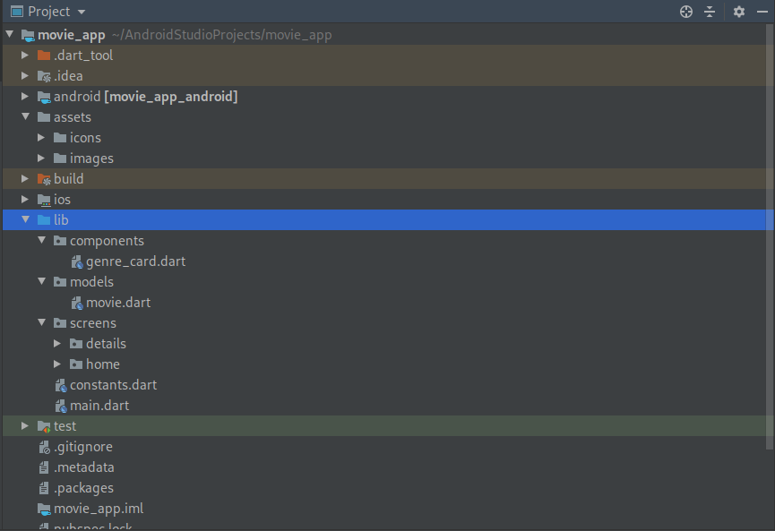

<h1 align="center">Movtrix Entertainment</h1>



> A mobile Application Designed using Flutter Framework

>NB:// 
This Codebase only covers the front-end part of the Application. For the Backend you can easily create a RestAPI and connect to this front-end.

>I will be writing on connecting RestAPI with Flutter in another Repository

## Introduction

> Flutter is an open-source UI software development kit created by Google. It is used to develop applications for Android, iOS, Linux, Mac, Windows and the web from a single codebase.

>The key features that I like in Flutter are:
><ul>

<li>Hot Reload: With which modifications to source files can be injected into a running application</li>

<li>Fast to code: Increase the speed to develop features by about 200% to 300%. *</li>

<li>Design-Specific Widgets: 
The Flutter framework contains two sets of widgets which conform to specific design languages. Material Design widgets implement Google's design language of the same name, and Cupertino widgets implement Apple's iOS Human interface guidelines. *</li>

</ul>

<br>
>This Repository is aimed at helping those who are working A Movie-like Mobile Application to have a ready base ready for cutomization.

 ## A few assumptions:
<ol>
<li>You have a good understanding of google Dart Language</li>
<li>You know your way around tools like Android Studio and Visual Studio Code</li>
</ol>

## Project Structure:


>The Repository contains 2 main folders and 1 main file namely:
<ol>

<li>assets</li>

This Folder contains our project Icons and Images
<li>lib</li>

This Folder contains the .dart files that contain our flutter code for the main screens and the different fron-end components of our application.

This Folder contains:
> Components folder - 
This folder contains the code for our application general components.

> models folder - 
This folder contains our demo data. When you connect your endppoints, you will probaly use this folder alot as a data store.

> Screens folder - 
This Folder contains the Code for our different screens in the application.

> constants.dart file - 
This file contains our constant variables.

> main.dart file -
This file acts as our maini entry file.

<li>pubsec.yml</li>
This File contains some of the Project settings including the location of our asset folder and project Dependancies.
</ol>

# About The Application
>Movtrix Entertainment specializes in Providing movies for their customers. This Application was developed to allow a customer to log in into the application and be able to search and select any movie that is on the application and be able to watch it .
> Once you open the Application you will find a list of all the movies and series available and also be able to view the specific movie/series details and be able to watch it.


## Code To Look Out For

> Just to show you  some of the important code snippets that basically are the flow of the application

<b>main.dart</b>
```
class MyApp extends StatelessWidget {
  // This widget is the root of your application.
  @override
  Widget build(BuildContext context) {
    return MaterialApp(
      title: 'MovieApp',
      theme: ThemeData(
        visualDensity: VisualDensity.adaptivePlatformDensity,
      ),
      home: HomeScreen(), //here we are calling the HomeScreen function in another file
    );
  }
}
```

When the app loads it calls the HomeScreen() function which is in another file to render it's content.

<b>home_screen.dart</b>
```
class HomeScreen extends StatelessWidget {
  final GlobalKey<ScaffoldState> _drawerKey = GlobalKey();

  @override
  Widget build(BuildContext context) {
    return Scaffold(
      key: _drawerKey,
      backgroundColor: Colors.white,
      appBar: buildAppBar(), we call the buildAppBar() function to further customize our app bar
      body: Body(), // we call the Body() function which is in another file
      ......
      ),
     };
}
```
The above piece of code we also create further function calls to render our views, this calling of methods allows us to create more complex User Interfaces.

> Throughout the Application you will notice a couple of function calls to another file. This expanding of the code allows us to write more complex User Interface while making it easier to debug and also makes the code looks clean.


## Install

```sh
git clone the repository
Open the folder in Android Studio or Visual Studio Code
Connect your Phone, or and emulator
Then CLick on run on Android Studio.
```


## Author

👤 **Collins H. Munene**

* Website: [My portfolio](https://collinsmunene.github.io/collinshillary.github.io/)
* Twitter: [@Hillary Collins](https://twitter.com/HillaryCollns)
* Github: [@Collins Munene](https://github.com/CollinsMunene)
* LinkedIn: [@Collins Munene](https://linkedin.com/in/collins-hillary-munene)

## Show your support

Give a ⭐️ if this project helped you!
